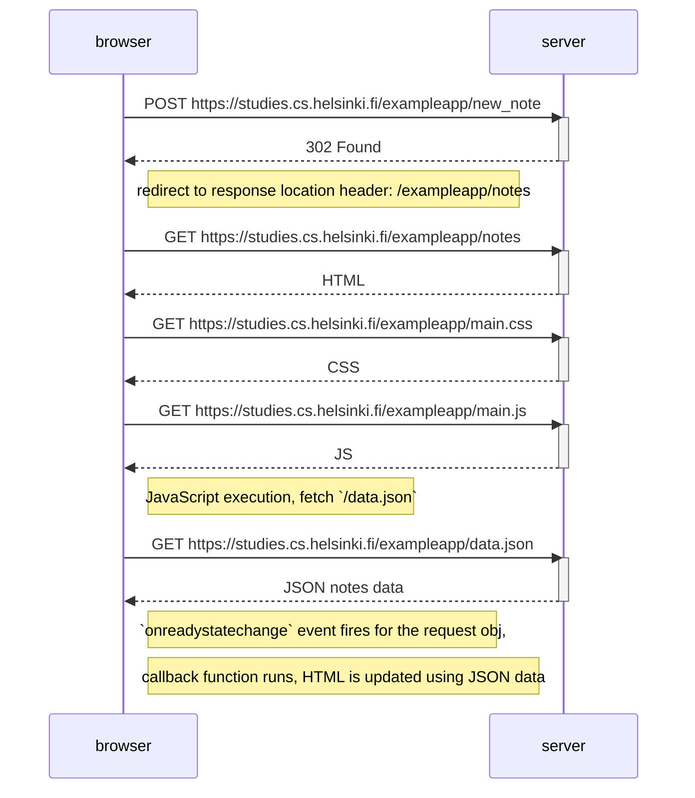

```mermaid

sequenceDiagram
  participant browser
  participant server

  browser->>server: POST https://studies.cs.helsinki.fi/exampleapp/new_note
  activate server
  server-->>browser: 302 Found
  deactivate server

  Note right of browser: redirect to response location header: /exampleapp/notes

  browser->>server: GET https://studies.cs.helsinki.fi/exampleapp/notes
  activate server
  server-->>browser: HTML
  deactivate server

  browser->>server: GET https://studies.cs.helsinki.fi/exampleapp/main.css
  activate server
  server-->>browser: CSS
  deactivate server

  browser->>server: GET https://studies.cs.helsinki.fi/exampleapp/main.js
  activate server
  server-->>browser: JS
  deactivate server

  Note right of browser: JavaScript execution, fetch `/data.json`

  browser->>server: GET https://studies.cs.helsinki.fi/exampleapp/data.json
  activate server
  server-->>browser: JSON notes data
  deactivate server

  Note right of browser: `onreadystatechange` event fires for the request obj,
  Note right of browser: callback function runs, HTML is updated using JSON data

```