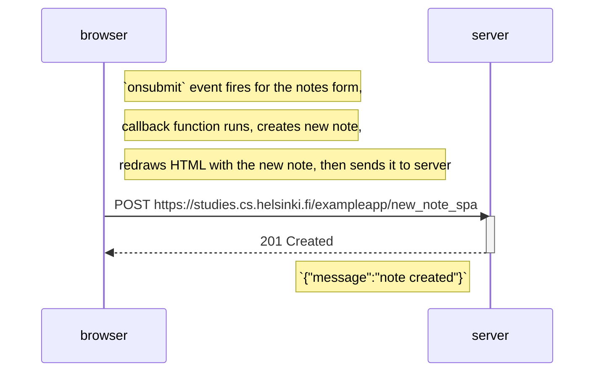

```mermaid

sequenceDiagram
  participant browser
  participant server

  Note right of browser: `onsubmit` event fires for the notes form,
  Note right of browser: callback function runs, creates new note,
  Note right of browser: redraws HTML with the new note, then sends it to server

  browser->>server: POST https://studies.cs.helsinki.fi/exampleapp/new_note_spa
  activate server
  server-->>browser: 201 Created
  deactivate server

  Note left of server: `{"message":"note created"}`

```